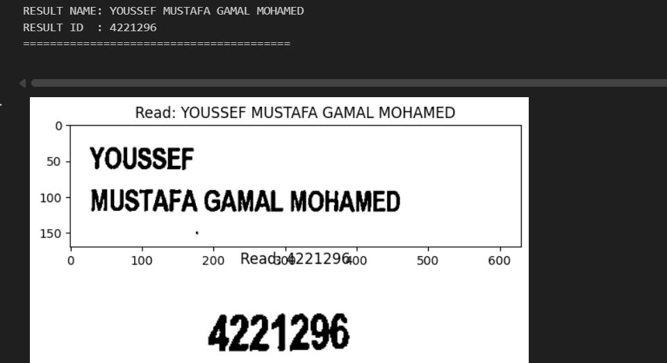
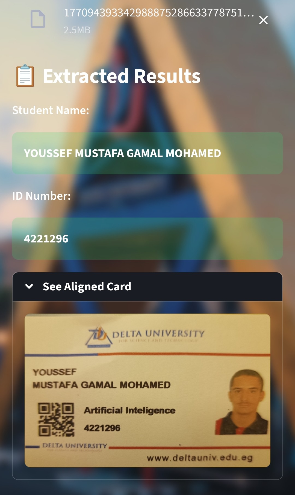

# 🏛️ DU ID Scanner

**Delta University – Automated Student ID OCR System**

A lightweight and highly accurate system for extracting student data from Delta University ID cards using **Classic Computer Vision** and OCR — no heavy deep learning models required.

---

## 🧠 Core Idea

Not every problem needs the latest deep learning model.

In this project, the real power came from **understanding the ID card layout itself**.  
By leveraging **classic computer vision techniques** instead of heavy models, we achieved:

- Higher accuracy
- Faster processing
- Lower cost
- Zero GPU dependency

This approach proved to be more efficient than using large deep learning pipelines for a fixed-layout problem like university ID cards.

---

## 🔍 How the System Works (Pipeline)

The system follows **5 clear and deterministic steps**:

### 1️⃣ Card Region Extraction

- Detect the ID card using **edge detection, dilation, and contour analysis**
- Crop the card area precisely from the input image

### 2️⃣ Image Enhancement

- Convert to grayscale
- Improve contrast using **CLAHE**
- Reduce noise and sharpen text regions

### 3️⃣ Fixed Zone Cropping

Since the ID layout is consistent:

- Crop predefined regions for:
  - Student Name
  - Student ID Number

### 4️⃣ OCR Preparation

Apply a balanced preprocessing pipeline:

- Gaussian blur
- Adaptive thresholding (Otsu)
- Morphological closing

This step ensures clean and readable text regions for OCR.

### 5️⃣ Text Recognition (OCR)

- Use **EasyOCR**
- Post-process results to:
  - Keep letters only for names
  - Keep digits only for ID numbers

---

## 🧪 Inference Results

Below are real test samples from the system:

### ✅ Test Sample 1



### ✅ Test Sample 2



---

## 📊 Final Results

- 🎯 **Accuracy:** 100% (zero reading errors)
- ⚡ **Speed:** < 3 seconds per ID
- 🚀 **Throughput:** 100+ students per minute
- 💻 **GPU:** Not required
- 🧠 **Heavy Models:** Not required
- 💰 **Cost:** Minimal (runs on CPU-only machines)

---

## 📁 Project Structure

```

DU-ID-Scanner/
│
├── app.py                # Streamlit application
├── assets/               # Test images & UI assets
│   ├── test1.png
│   ├── test2.png
│   ├── background.jpg
│   └── Delta Univ.png
├── requirements.txt      # Project dependencies
└── README.md

```

---

## ⚙️ Installation

Clone the repository:

```bash
git clone https://github.com/your-username/DU-ID-Scanner.git
cd DU-ID-Scanner
```

Install dependencies:

```bash
pip install -r requirements.txt
```

---

## ▶️ Run the Application

Start the Streamlit app:

```bash
streamlit run app.py
```

Then upload a Delta University ID card image and get instant results.

---

## 👤 Author

**Mohiey Elkiouty**

- **LinkedIn:** [Mohiey Elkiouty](https://www.linkedin.com/in/mohiey-elkiouty/)
- **Freelancer:** [Mohiey Elkiouty](https://www.freelancer.com/u/mohymohamed004)

---

## ⭐ Support

If you find this project useful:

⭐ Star the repository

🔁 Share it with the community

🤝 Connect on LinkedIn

